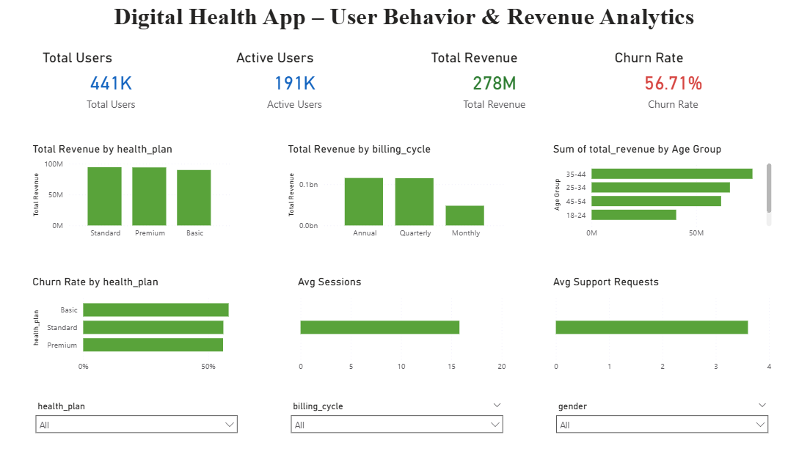

# digital-health-retention-analytics-powerbi
Power BI dashboard analyzing user behavior, revenue performance, and churn drivers for a subscription-based digital health application.

# Digital Health App – User Behavior & Retention Analytics

## Project Overview
This project presents a two-page Power BI dashboard focused on analyzing user behavior, subscription performance, and churn drivers within a digital health application.

The goal of this analysis was to understand why users churn, identify high-risk segments, and evaluate how engagement and billing models impact retention and revenue performance.

## Business Objectives
- Measure overall churn rate and revenue performance
- Identify lifecycle stages with the highest churn risk
- Analyze the impact of billing cycle on retention
- Compare engagement and support behavior between churned and active users
- Segment users based on revenue contribution and churn exposure

## Dashboard Structure

# Page 1 – Executive Overview
Provides high-level KPIs and revenue insights:
- Total Users
- Active Users
- Total Revenue
- Churn Rate
- Revenue by Health Plan
- Revenue by Billing Cycle
- Churn by Health Plan
- Average Sessions
- Average Support Requests

# Page 2 – Retention & Churn Intelligence
Focused on identifying churn drivers and risk patterns:
- Churn Rate by Tenure Group
- Engagement Comparison (Churned vs Active Users)
- Support Request Analysis
- Revenue Segment Risk Analysis
- Churn Rate by Billing Cycle
- Payment Delay Impact on Churn

## Key Insights
- Churn peaks during the 12–24 month lifecycle stage, suggesting retention challenges after the first year.
- Monthly subscribers experience significantly higher churn compared to Annual plans.
- Low-revenue users demonstrate complete churn behavior within the dataset.
- Churned users show higher support requests and slightly lower engagement levels, indicating potential dissatisfaction.

## Tools & Skills Used
**Power BI**
- DAX (Measures & Calculated Columns)
- Data Modeling
- SaaS Retention Analysis
- KPI Development
- Business Insight Storytelling
- Dashboard Design & Layout Optimization

## Dataset Source
The dataset used in this project was Public customer churn dataset sourced from Kaggle.
The dataset was used for analytical and educational purposes.

## Dashboard Preview

## Conclusion
This project demonstrates an end-to-end Business Intelligence workflow, including data modeling, KPI development, churn analysis, revenue segmentation, and executive-level dashboard storytelling.

The final dashboard transforms raw customer data into actionable retention insights that could support strategic decision-making in a subscription-based SaaS business.
